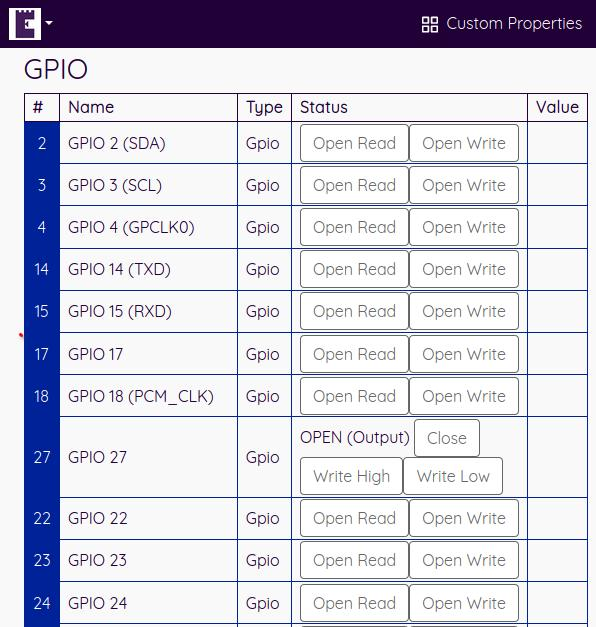

# General Purpose Input Output (GPIO)

Devices can declare their GPIO capabilities which allows the Relay Cloud portal to show simple controls for reading and writing GPIO pins.

This allows you switch connected devices on and off, and read high and low values.



## GPIO Data Specification

### Request from Relay Cloud

The Relay cloud will make a request to `{device IP}:{device port}/api/1.0/gpio`. 

The request will be accompanied by a JWT on the `Authorization` header, the scheme will be `Bearer`.

The JWT will be digitally signed and can be cryptographically verified by the keys published [here](https://edgecastle.com/.well-known/openid-configuration).

To minimise the potential of replay attacks, the JWT will contain a single scope: `read-gpio`, and the lifetime of the JWT will be 5 minutes. The JWT does not support refresh flows.

### Response from your device

The response from your device will be a JSON array containing zero or more objects with the following structure:

```json
    [{
        "pinInfo":{
            "number":2,
            "type":"Gpio",
            "canRead":true,
            "canWrite":true,
            "name":"GPIO 2 (SDA)"
        },
        "pinOpen":false,
        "pinMode":null,
        "value":null
    }
    ....
    ]
```

Explanation of properties:

* *number* - The logical GPIO pin number (i.e. the GPIO number, not the pin number)
* *canRead* - `true` or `false` (whether the GPIO pin can be read right now - requires the pin to be Opened in INPUT mode first)
* *canWrite* - `true` or `false` (whether the GPIO pin can be pulled high or low - requires the pin to be Opened in OUTPUT mode first)
* *name* - The name of the pin
* *type* - `Gpio` only supported
* *pinMode* - `OUTPUT` or `INPUT`
* *value* - `HIGH` or `LOW`


For more advanced device data handling than just high/low, please see [Custom Properties](./properties).