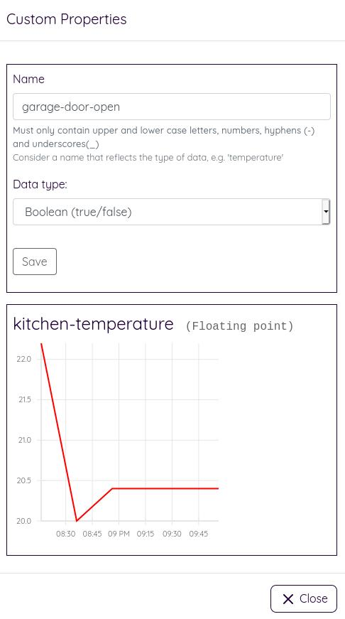

# Custom Properties

Custom Properties are the means by which sensors and devices can record information (such as temperature), which can be displayed as a time-series chart. 

Custom properties can be created with one of the following data types:

* 64-bit Integer (whole number)
* Floating Point (max precision of 5 decimal places)
* Boolean values (true/false)

Once you have created a custom property, you can write values to it by sending an HTTPS POST request to the following URL:

`POST https://edgecastle.com/api/1.0/properties/<name-of-property>`

You must include an authorization header with an [Api Key](./security) that has the `write-property` grant:

`Authorization: ApiKey abc123def456......`

The content type must be set:

`Content-Type: application/json`

The body should be set as following:

`{value: <value>}`
