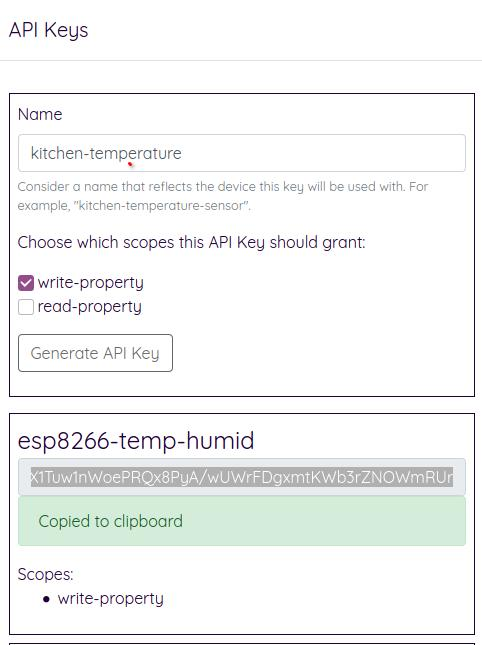

# Security

The most important principle in the design of Relay is security.

Security is implemented in layers and there are often multiple protections that can be employed, based on your risk tolerance.

## Connections to edgecastle.com

Edgecastle.com requires HTTPS (secure hypertext transfer protocol) for all connections.

We use the amazing [Cloudflare](https://www.cloudflare.com) for securing our website and protecting us against malicious traffic.

## Connecting simple devices to Relay

For simpler devices like the [ESP8266 WiFi Module](./esp8266-arduino) Relay supports API Key bearer token authorization. For fully featured devices like Raspberry Pis or desktop / laptop computers, you can use interactive [OpenID Connect](https://openid.net/connect) flows that will grant short lived access tokens and longer lived refresh tokens.

### Api Keys

You can create an API Key from the top menu in Relay Cloud:



API Keys are 50-character random strings created by a cryptographic random-number-generator (RNG).

The crypto-RNG-based creation process makes API Keys extremely hard to guess or brute-force.

API Keys are given restricted access to Relay platform features. At the time of writing, API Keys can be used to grant access to either:

* *write-property* 
  * (used to recording device information such as temperature from a temperature sensor, or CPU %)
* *read-property* 
  * (used to read the latest property which can be used as a trigger - for example, switch on heating when temperature drops below a threshold)

You can read about [Custom Properties here](./properties).

API Keys are then added to the request from the device:

`Authorization: ApiKey abc123def456.....`

## Connecting Raspberry Pis to Relay Cloud

Devices that can provide both client and server functionality allow for much richer integrations with Relay Cloud.

The client needs to prepare an authorization request that will be sent to Edgecastle's identity service:

```text
https://edgecastle.com/connect/authorize?
    response_type=code
    &scope=create-device
    &client_id=s6BhdRkqt3
    &stqate=af0ifjsldkj
    &redirect_uri=https%3A%2F%2Fclient.example.org%2Fcb
```


https://server.example.com/authorize?response_type=code&scope=openid%20profile%20email&client_id=s6BhdRkqt3&state=af0ifjsldkj&redirect_uri=https%3A%2F%2Fclient.example.org%2Fcb

While you can [build your own Relay Client](./relay-client-spec) the fastest way to get start on a Raspberry Pi is to use the [Sample Client](./raspberry-pi-installation).